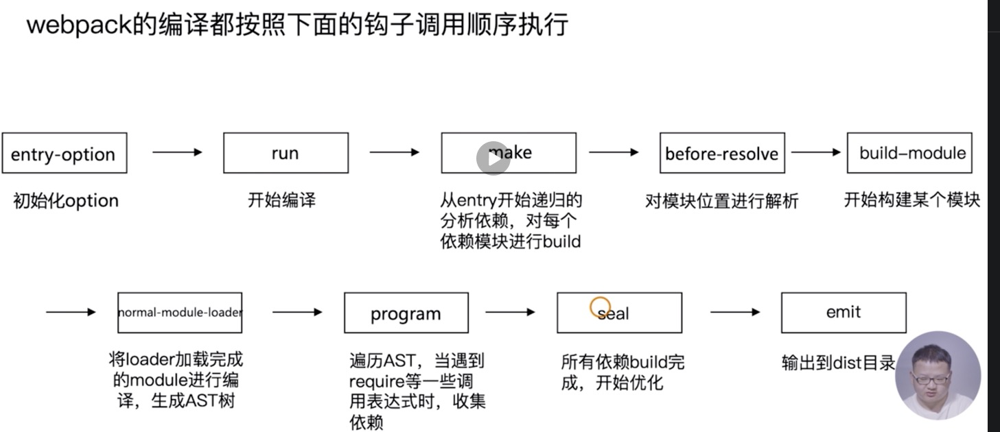

[builder-webpack](./builder-webpack/readme.md) 功能设计和目录设计、测试 DEMO

[example](./example/readme.md) 没有划分功能的大杂烩（最基础的）

[loader-order](./loader-order/README.md) loader 被加载的顺序

[my-plugin] 编写 webpack 插件

[raw-loader](./raw-loader/README.md)loader 开发

[sprite-loader-source](./sprite-loader-source) 雪碧 loader 开发

[tapable-test](./tapable-test/README.md) 看 webpack 源码解析

[webpack-simple-source](./webpack-simple-source/README.md) 一个简易的 webpack

[zip-plugin](./zip-plugin/README.md) 打包压缩包 zip

# webpack 启动过程分析

## webpack 最终找到 webpack-cli(webpack-command) 这个 npm 包，并且执行 CLI

# webpack-cli 源码分析

-   引入 yargs 包，对命令行进行定制
-   分析命令行参数，对各个参数进行转换，组成编译配置项
-   引用 webpack,根据配置项进行编译和构建

`webpack-cli` 处理不需要经过编译的命令

`webpack-cli` 对配置文件和命令行参数进行转换最终生成配置选项参数 options

最终会根据配置参数实例化 webpack 对象，然后执行构建流程

# Tapable 插件架构与 Hooks 设计

## webpack 本质

webpack 可以将其理解是一种基于事件流的编程范例，一系列的插件运行。

[](./tapable-test)

Tapable 是如何和 webpack 联系起来的？
模拟 [Compiler.js](./tapable-test/Compiler.js)
插件 [my-plugin.js](./tapable-test/my-plugin.js)
模拟插件执行 [my-plugin.js](./tapable-test/my-plugin.js)

新版的 webpack-cli 不需要全局安装,
但是在装的时候还是需要权限`sudo` ./node_modules/.bin/webpack init

# Webpack 流程篇

webpack 的编译都按照下面的钩子调用顺序执行



-   准备阶段
    看`./node_modules/webpack/lib/webpack.js`
    `WebpackOptionsDefaulter`初始的操作方法
    `NodeEnvironmentPlugin` 环境设置插件 在 `entry-option`--->`run`之间

    ```bash
    grep "entryOption" -rn ./node_modules/webpack
    ```

    查询 "entryOption" 部分在哪里调用的？

    ‘WebpackOptionsApply’将所有的配置 options 参数转换成 webpack 内部插件

    使用默认插件列表

    举例：

    output.library -> LibraryTemplatePlugin
    ...

    所有插件最终都会变成 `Compiler` 对象的一个实例

-   模块打包构建
-   模块的优化，代码生成，生成到磁盘
