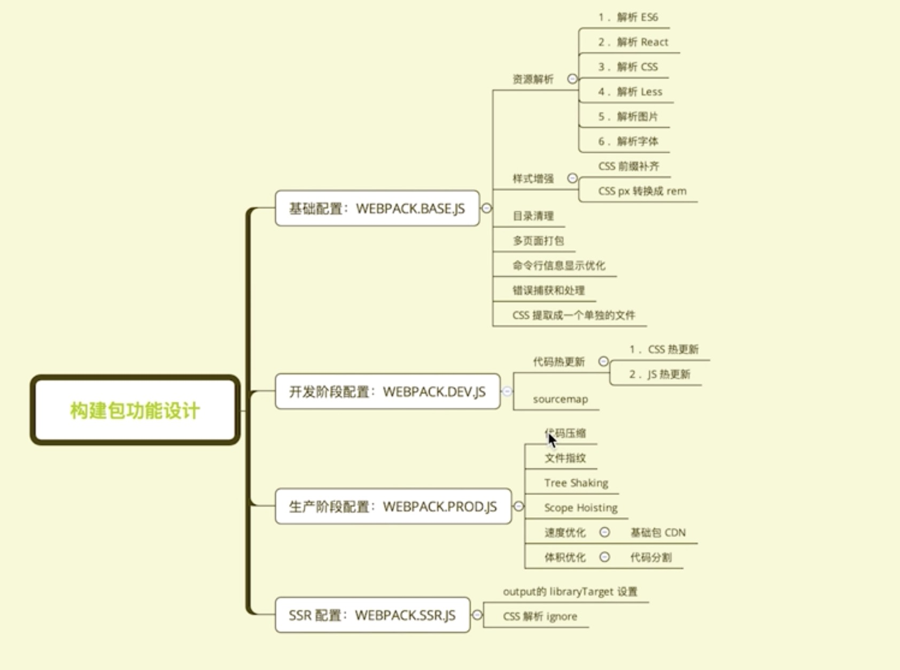
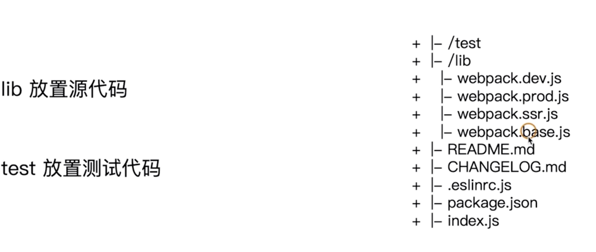
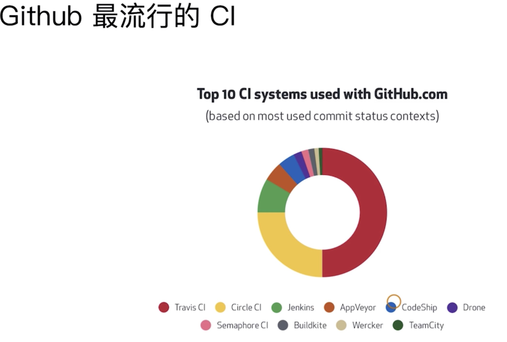

`yarn test`冒烟测试
`yarn eslint` 使用 eslint 规范构建脚本

# 功能模块设计



# 目录结构设计



## [基础配置](./test/smoke/readme.md)

### 构建配置管理的可选方案

-   通过多个配置文件管理不同环境的构建，webpack --config 参数进行控制

    -   [基础配置：webpack.base.js](./lib/readme.base.md)
    -   [开发环境：webpack.dev.js](./lib/readme.dev.md)
    -   [生产环境：webpack.prod.js](./lib/readme.prod.md)
    -   [SSR 环境：webpack.ssr.js](./lib/readme.ssr.md)
        ......

        通过 webpack-merge 组合配置

        ```javascript
        //合并配置：
        const merge=require('webpack-merge');
        ......
        module.exports=merge(baseConfig,devConfig);
        ```

-   将构建配置设计成一个库，比如：hjx-webpack、Neutrino、webpack-blocks

    -   规范：Git commit 日志、README、ESLint 规范、Semver 规范
    -   质量：冒烟测试、单元测试、测试覆盖率和 CI

-   抽成一个工具进行管理，比如：create-react-app,kyt,nwb
-   将所有的配置放在一个文件，通过 --env 参数控制分支选择

## 使用 ESLint 规范构建脚本

```bash
npm i eslint babel-eslint eslint-config-airbnb-base babel-eslint -D
```

eslint --fix 可以自动处理空格

npm install eslint-plugin-import@latest --save-dev

运行`./node_modules/.bin/eslint lib/`
然后在 pageage.json 里面 ，加上`"eslint": "eslint ./lib --fix"` ,运行`yarn eslint`，报错数量减少
逐个根据提示改进，最后再运行`yarn eslint`，直到没有提示

## 一、[冒烟测试(smoke testing)](./test/smoke/readme.md)

### 1. 构建是否成功（判断构建是否成功）

### 2. 每次构建完成 build 目录是否有内容输出

## 二、[单元测试和测试覆盖率](./test/readme.md)

技术选型：Mocha+Chai
测试代码：describe,it,except
测试命令：mocha add.test.js

1、安装 [mocha](https://mochajs.org/) + chai

```bash
npm i mocha chai -D
```

2、新建 test 目录，并增加 xxx.test.js 测试文件
3、在 package.json 中的 scripts 字段增加 test 命令

```json
"scripts":{
    "test":"node_modules/mocha/bin/_mocha"
}
```

4、执行测试命令

```bash
npm riun test
```

```javascript
// add.test.js
```

5、测试覆盖率 安装`npm i istanbul -D`,然后在 pageage.json 里面修改 script

```json
"scripts": {
    "eslint": "eslint ./lib --fix",
    "maoyan": "node test/smoke/index.js",
    "unit": "./node_modules/mocha/bin/_mocha",
    "fugai": "istanbul cover ./node_modules/mocha/bin/_mocha"
}
```

最后再次运行`yarn fugai` or `npm run fugai`

## 持续集成和 TravisCI


