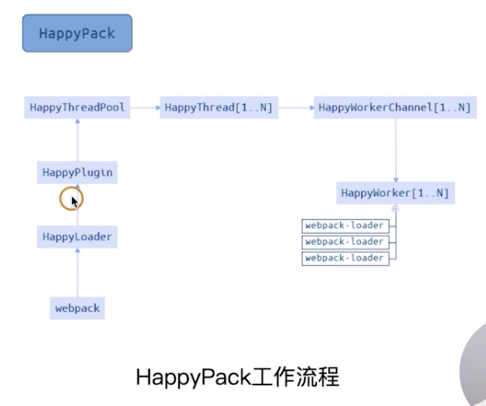

[builder-webpack](../builder-webpack/readme.md) 测试 DEMO

# 优化

## `初级分析`：使用 webpack 内置的 stats

stats:构建的统计信息

package.json 中使用 stats

```javascript
"scripts":{
    "build:stats":"webpack --env production --json > stats.json"
}
```

### Node.js 中使用

```javascript
const webpack = require("webpack");
const config = require("./webpack.config.js")("production");

webpack(config, (err, stats) => {
    if (err) {
        return console.error(err);
    }

    if (stats.hasErrors()) {
        return console.error(stats.toString("errors-only"));
    }

    console.log(stats);
});
```

`npm run build:stats` 会建立一个 stats.json 文件，里面显示了所有打包文件的详细信息

## `速度分析`：使用 [speed-measure-webpack-plugin](https://github.com/stephencookdev/speed-measure-webpack-plugin)

```javascript
const SpeedMeasureWebpackPlugin = require("speed-measure-webpack-plugin");

const smp = new SpeedMeasureWebpackPlugin();

const webpackConfig = smp.wrap({
    plugins: [new MyPlugin(), new MyOtherPlugin()]
});
```

可以看到每个 loader 的插件执行耗时

分析整个打包总耗时
每个 loader 的插件执行耗时

```bash
npm i speed-measure-webpack-plugin -D
```

## `体积分析`：使用 [webpack-bundle-analyzer](https://github.com/webpack-contrib/webpack-bundle-analyzer) 分析体积

可以分析哪些问题？

依赖的第三方模块文件大小

业务里面的组件代码大小

```bash
npm i webpack-bundle-analyzer -D
npm i babel-polyfill -S //转换插件
```

```javascript
const SpeedMeasureWebpackPlugin = require("speed-measure-webpack-plugin");
const smp = new SpeedMeasureWebpackPlugin();
module.exports = smp.wrap({});
```

preset 与 plugin 的关系:

preset 中已经包含了一组用来转换 ES6+的语法的插件,如果只使用少数新特性而非大多数新特性,可以不使用 preset 而只使用对应的转换插件
babel 默认只转换语法,而不转换新的 API,如需使用新的 API,还需要使用对应的转换插件或者 `polyfill`

例如，默认情况下 babel 可以将箭头函数，class 等语法转换为 ES5 兼容的形式，但是却不能转换 Map，Set，Promise 等新的全局对象，这时候就需要使用 polyfill 去模拟这些新特性

#### 1. 使用转换插件: babel-plugin-transform-xxx

-   使用方法

    -   缺啥补啥,在 package.json 添加所需的依赖 babel-plugin-transform-xxx
    -   在.babelrc 中的 plugins 项指定使用 babel-plugin-transform-xxx 插件
    -   代码中不需要显式 import/require, .babelrc 中不需要指定 useBuiltIns, webpack.config.js 中不需要做额外处理,一切由 babel 插件完成转换

-   优点

    -   作用域是模块,避免全局冲突
    -   是按需引入,避免不必要引入造成及代码臃肿

-   缺点

    -   每个模块内单独引用和定义 polyfill 函数,造成了重复定义,使代码产生冗余

    > 配置完一个转换插件后, 代码中每个使用这个 API 的地方的代码都会被转换成使用 `polyfill` 中实现的代码

#### 2. 使用插件 babel-runtime 与 babel-plugin-tranform-runtime

相比方法 1, 相当于抽离了公共模块, 避免了重复引入, 从一个叫 core.js 的库中引入所需 polyfill(一个国外大神用 ES3 写的 ES5+ polyfill)

-   使用方法
    -   package.json 中添加依赖 babel-plugin-tranform-runtime 以及 babel-runtime
    -   .babelrc 中配置插件:"plugins": ["transform-runtime"]
    -   接下来, 代码中可以直接使用 ES6+的新特性,无需 import/require 额外东西, webpack 也不需要做额外配置
-   优点
    -   无全局污染
    -   依赖统一按需引入(polyfill 是各个模块共享的), 无重复引入, 无多余引入
    -   适合用来编写 lib(第三方库)类型的代码
-   缺点
    -   被 polyfill 的对象是临时构造并被 import/require 的,并不是真正挂载到全局
    -   由于不是全局生效, 对于实例化对象的方法,如[].include(x), 依赖于 Array.prototype.include 仍无法使用

#### 3. 全局 babel-polyfill(不使用 useBuiltIns)

-   使用方法
    -   法 3.1: (浏览器环境)单独在 html 的<head>标签中引入 babel-polyfill.js(CDN 或本地文件均可)
    -   法 3.2: 在 package.json 中添加 babel-polyfill 依赖, 在 webpack 配置文件增加入口: 如 entry: ["babel-polyfill",'./src/app.js'], polyfill 将会被打包进这个入口文件中, 而且是放在文件最开始的地方
    -   法 3.3: 在 package.json 中添加 babel-polyfill 依赖, 在 webpack 入口文件顶部使用 import/require 引入,如`import 'babel-polyfill'``
-   优点
    -   一次性解决所有兼容性问题,而且是全局的,浏览器的 console 也可以使用
-   缺点
    -   一次性引入了 ES6+的所有 polyfill, 打包后的 js 文件体积会偏大
    -   对于现代的浏览器,有些不需要 polyfill,造成流量浪费
    -   污染了全局对象
    -   不适合框架或库的开发

#### 4. 全局 babel-polyfill(使用 babel-preset-env 插件和 useBuiltIns 属性)

-   使用方法
    -   packge.json 引入依赖 babel-preset-env
    -   .babelrc 中使用配置 preset-env
    -   指定 useBuiltins 选项为 true
    -   指定浏览器环境或 node 环境, 配置需要兼容的浏览器列表
    -   在 webpack 入口文件中使用 import/require 引入 polyfill, 如 import 'babel-polyfill'
    -   以上配置完成之后, babel 会根据指定的浏览器兼容列表自动引入所有所需的 polyfill, 不管你代码中有没有使用
    -   babelrc 示例
        ```json
        {
            "presets": [
                [
                    "env",
                    {
                        "modules": false,
                        "targets": {
                            "browsers": ["ie >=9"]
                        },
                        "useBuiltIns": true,
                        "debug": true
                    }
                ]
            ]
        }
        ```
-   优点

    -   按需(按照指定的浏览器环境所需)引入 polyfill, 一定程度上减少了不必要 polyfill 的引入

    -   配置简单, 无需对 webpack 做额外的配置

    -   注意:

        -   不可与方法 3 混用,否则会引起冲突
        -   全局方式要保证 polyfill 在所有其它脚本之前被执行(首行 import 或者设置为 html 的第一个<head>标签)

#### 5. polyfill.io

一个 CDN 方式提供的 polyfill, 可根据浏览器 UserAgent 自动返回合适的 polyfill, 详细内容自行 google

## 使用高版本的 webpack 和 node.js

-   使用 webpack4：`优化原因`
    -   V8 带来的优化（for of 替代 forEach、Map 和 Set 替代 Object、includes 替代 indexOf）
    -   默认使用更快的 md4 hash 算法
    -   webpacks AST 可以直接从 loader 传递给 AST ,减少解析事件
    -   使用字符串方法替代正则表达式

## 多进程多实例并行压缩

### 可选方案

-   thread-loader
-   parallel-webpack
-   HappyPack

### 多进程/多实例：使用 `[HappyPack](https://github.com/amireh/happypack)` 解析资源

> 原理:每次 webpack 解析一个模块，`HappyPack` 会将它及它的依赖赔给 `worker` 线程中



```bash
sudo npm i happypack -D
```

```javascript
const HappyPack = require("happypack");
module: {
        rules: [
            {
                test: /.js$/,
                use: [
                    // "babel-loader",
                    "happypack/loader"
                    // "eslint-loader"
                ]
            }
        ],
        ...
        plugins:[
            ...
            new HappyPack({
                loaders: ["babel-loader"]
            })
        ]
    }
```

### 多进程/多实例：使用 `[thread-loader](https://github.com/webpack-contrib/thread-loader)` 解析资源

> 原理:每次 webpack `thread-loader` 会将它及它的依赖赔给 `worker` 线程中

```bash
npm i thread-loader -D
```

```javascript
module: {
    rules: [
        {
            test: /.js$/,
            use: [
                {
                    loader: "thread-loader",
                    options: {
                        workers: 3 //采用3个worker进程
                    }
                },
                "babel-loader"
            ]
        }
    ];
}
```
