-   安装 编译解析 ES6

    -   1.`npm i @babel/core @babel/preset-env babel-loader -D`
    -   2.建立.babelrc

-   解析 React JSX
    -   1. `npm i react react-dom @babel/preset-react -D`
    -   2.  建立 src/search.js 写入 react
-   解析 CSS
    -   1. `npm i style-loader css-loader -D`
    -   2. css-loader 用于加载.css 文件，并且转换成 commonjs 对象;style-loader 将样式通过`<style>`标签插入到 head 中
-   解析 Less 和 Sass
    -   1.less-loader 用于将 less 转换成 css `npm i less less-loader -D`
    -   2.sass-loader 用于将 sass 转换成 css
-   解析图片
    -   1.`npm i file-loader -D`
-   解析字体
    -   1.`npm i file-loader -D`
-   资源解析

    -   `npm i url-loader -D`
    -   也可以处理图片和字体
    -   可以设置较小资源自动 base64

-   webpack 中文件监听 两种方法

    -   启动 webpack 命令时，带上--watch 参数
    -   在配置 webpack.config.js 中设置 watch:true
        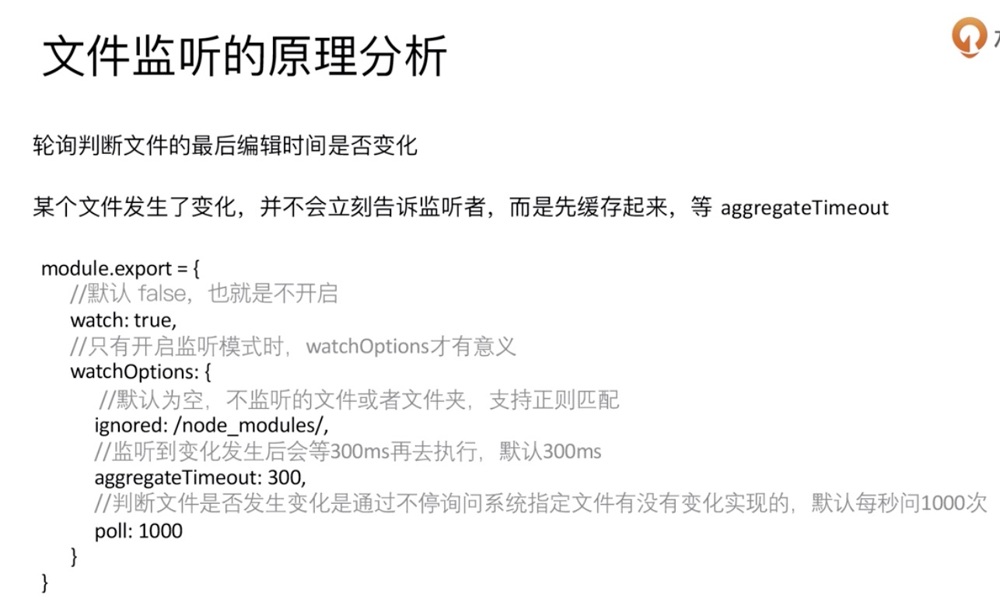

-   webpack 中的热更新及原理

    -   热更新【方法一】：webpack-dev-server WDS `npm i webpack webpack-cli webpack-dev-server -D`
        -   WDS 不刷新浏览器
        -   WDS 不输出文件，而是放在内存中
        -   使用 HotModuleReplacementPlugin 插件
    -   热更新【方法二】：webpack-dev-middleware ``
        -   WDM 将 webpack 输出的文件传输给服务器
        -   适用于灵活的定制场景
            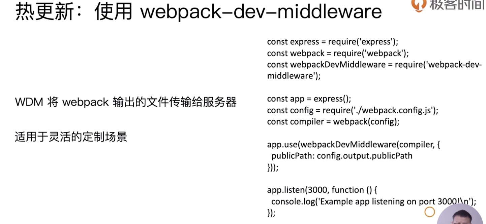

-   热更新的原理分析
    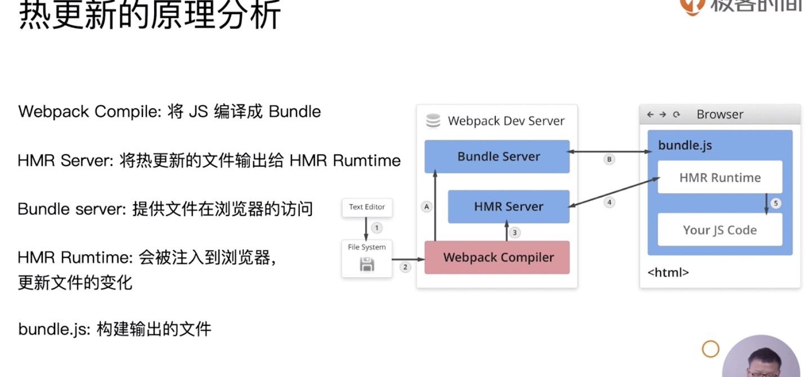

-   将 css 打包成单独的文件 `npm i mini-css-extract-plugin -D`

-   文件指纹

    -   打包后输出的文件名的后缀
        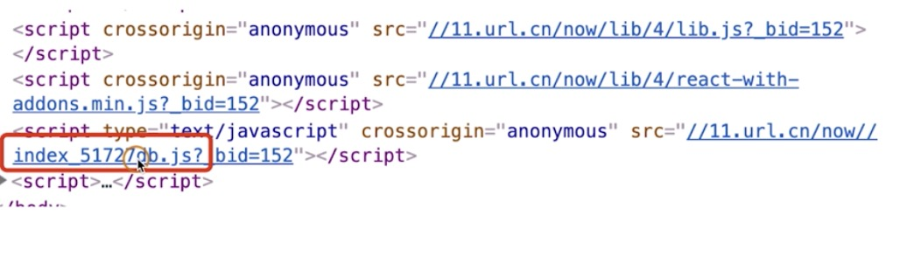

    -   文件指纹如何生成
        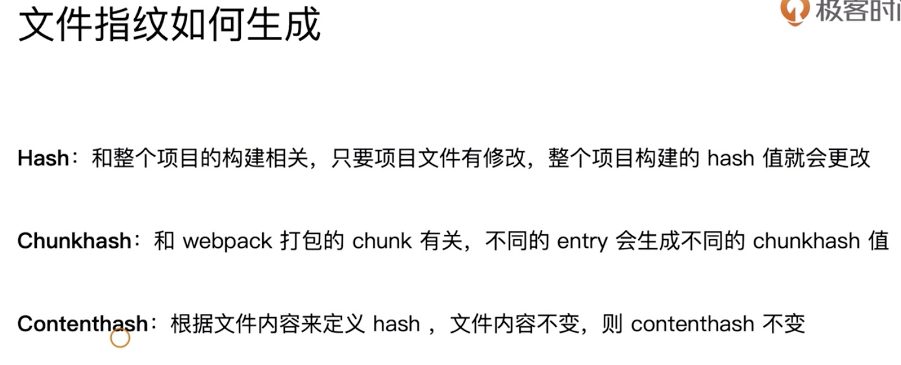
    -   JS 文件指纹设置 使用[chunkhash]
        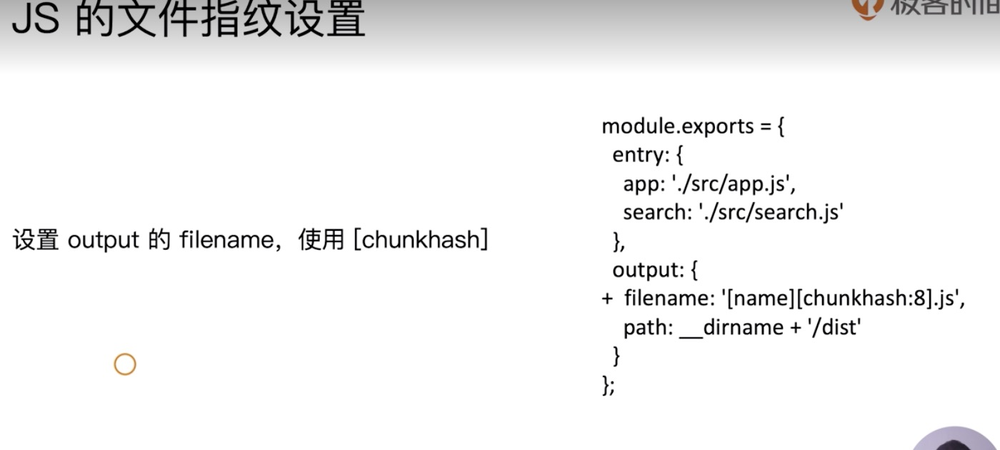
    -   CSS 文件指纹设置
        设置 MiniCssExtractPlugin 的 filename,使用[contenthash]
        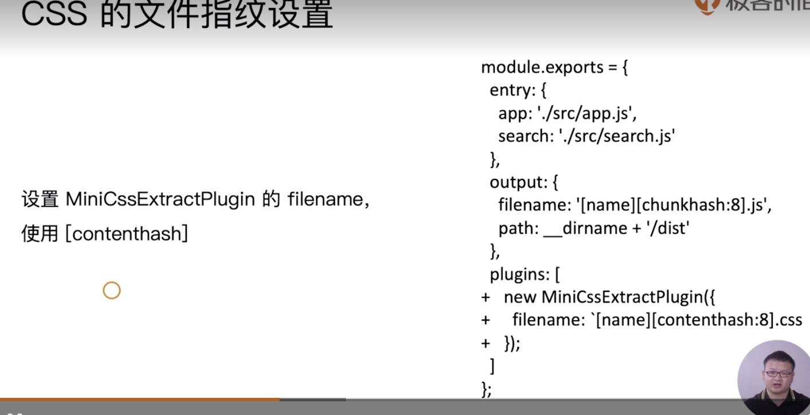
    -   图片文件指纹设置
        设置 file-loader 的 name,使用[hash]
        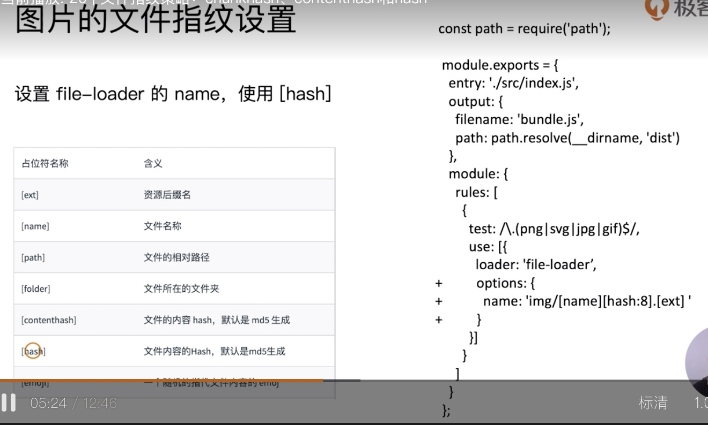

-   代码压缩
    -   HTML 压缩 `npm i html-webpack-plugin -D`
        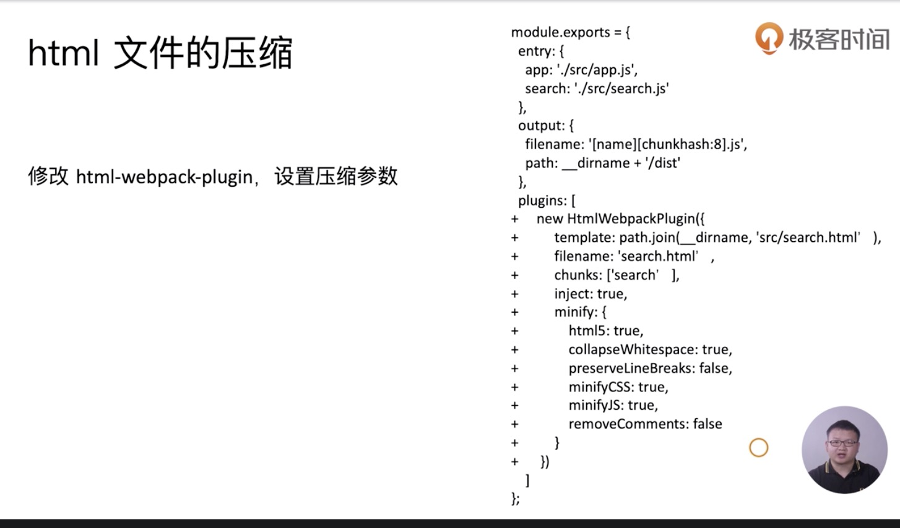
    -   CSS 压缩 `npm i optimize-css-assets-webpack-plugin -D`压缩 css `npm i cssnano -D`css 预处理器
        使用 `optimize-css-assets-webpack-plugin`
        同时使用 `cssnano`
        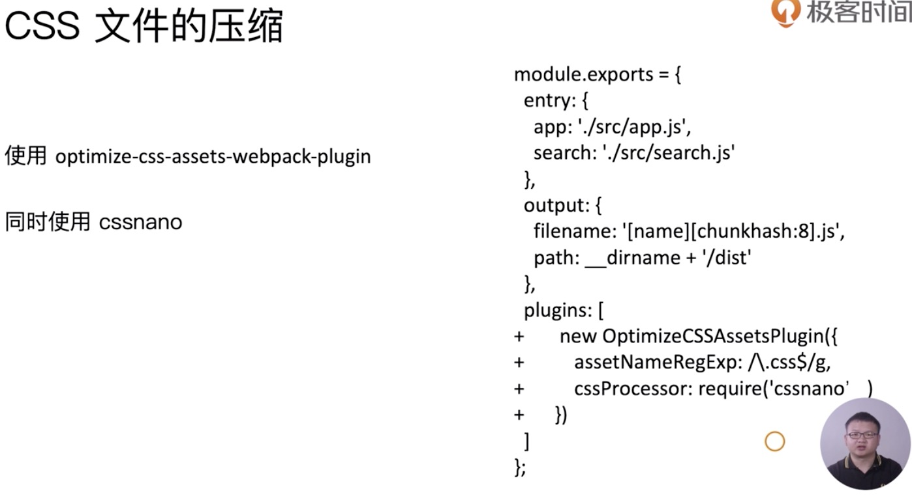


    -   JS 压缩
        内置了 uglifyjs-webpack-plugin

-   自动清理构建目录产物
    -   通过 npm scripts 清理构建目录
        `rm -rf ./dist && webpack` or `rimraf ./dist && webpack`
    -   使用 clean-webpack-plugin 默认会删除 output 指定的输出目录
        `npm i clean-webpack-plugin -D`
-   PostCSS 插件 `autoprefixer` 自动补齐 CSS3 前缀
    -   `npm i postcss-loader autoprefixer -D`
    -   使用 `autoprefixer` 插件,根据 Can I Use 规则(https://caniuse.com/)
        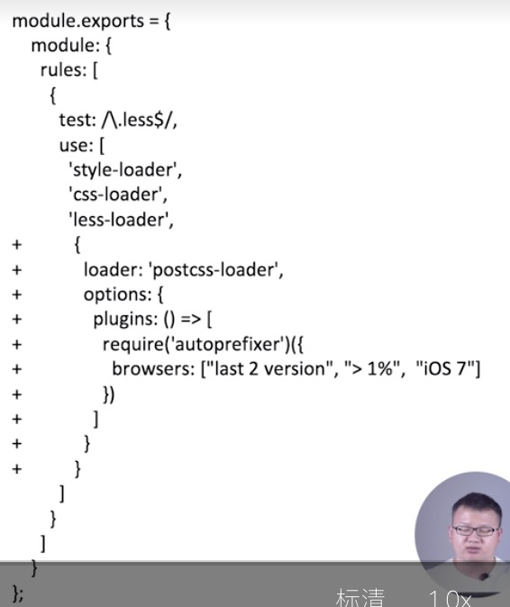
-   移动端 CSS px 自动转换成 rem
    -   W3C 对 rem 定义：font-size of the root element
    -   rem 和 px 的对比
        -   rem 是相对单位
        -   px 是绝对单位
            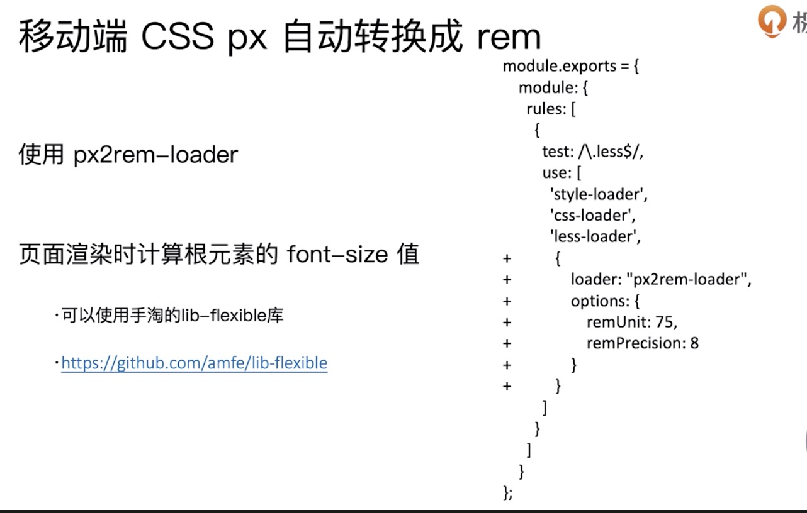
    -   `npm i px2rem-loader -D`
    -   `npm i lib-flexible -S`
-   静态资源内联

    -   代码层面：
        -   页面框架的初始化脚本
        -   上报相关打点
        -   css 内联避免页面闪动
    -   请求层面：减少 HTTP 网络请求数 - 小图片或者字体内联(`url-loader`)
    -   HTML 内联和 JS 内联

        `npm i raw-loader@0.5.1 -D` 最新版的包引进静态内联资源写法不一样

        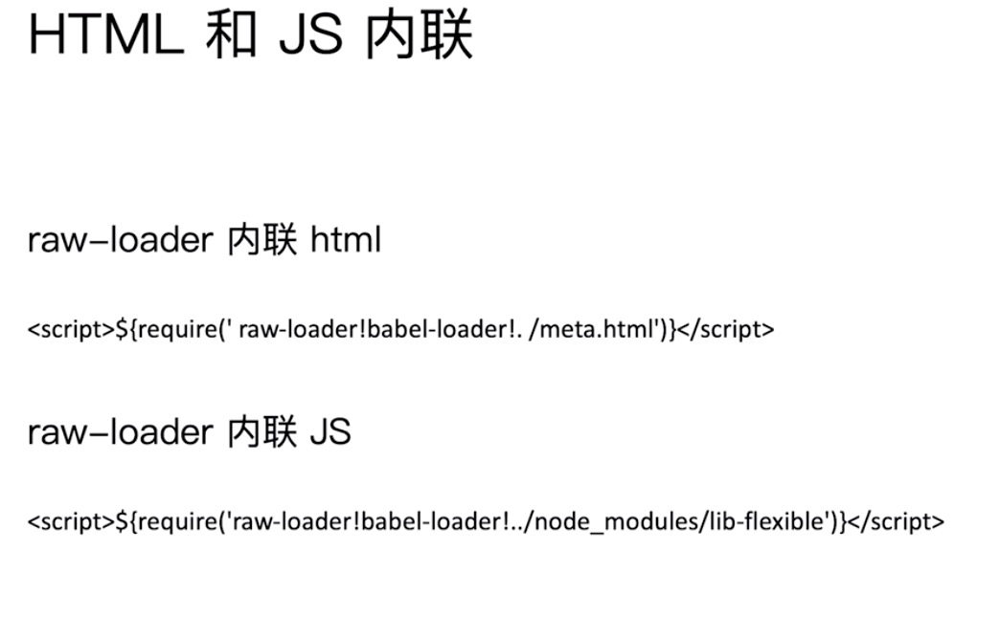


    -   CSS 内联

        -   方案一：借助 Style-loader
        -   方案二：html-inline-css-webpack-plugin

        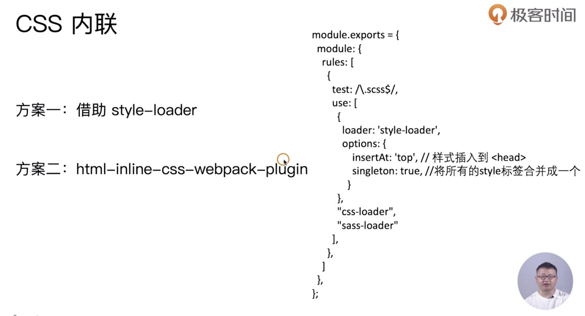

-   多页面应用（MPA）概念

    每一次页面跳转的时候，后台服务器都会给返回一个新的 html 文档，这种类型的网站也就是多页网站，也叫做多页应用

    ## 多页面打包基本思路

    每个页面对应一个 entry,一个 html-webpack-plugin

    缺点 : 每次新增或删除页面需要改 webpack 配置

    ## 多页面打包通用方案

    动态获取 entry 和设置 html-webpack-plugin 数量

    利用 glob.sync [glob](https://www.npmjs.com/package/glob)

    [entry:glob.sync(path.join(\_\_dirname,'./src/\*/index.js'))]()

    ```bash
        npm i glob -D
    ```

    ```javascript
    /**
     * 动态的获取entry
     */
    const setMPA = () => {
        const entry = {};
        const htmlWebpackPlugins = [];

        const entryFiles = glob.sync(path.join(__dirname, "./src/*/index.js"));
        Object.keys(entryFiles).map(index => {
            const entryFile = entryFiles[index];
            //'/Users/fangcao/Documents/study/study_webpack/src/index/index.js'
            const match = entryFile.match(/src\/(.*)\/index\.js/);

            const pageName = match && match[1];
            entry[pageName] = entryFile;

            htmlWebpackPlugins.push(
                new HtmlWebpackPlugin({
                    template: path.join(
                        __dirname,
                        `src/${pageName}/index.html`
                    ),
                    filename: `${pageName}.html`,
                    chunks: [pageName],
                    inject: true,
                    minify: {
                        html5: true,
                        collapseWhitespace: true,
                        preserveLineBreaks: false,
                        minifyCSS: true,
                        minifyJS: true,
                        removeComments: false
                    }
                })
            );
            // console.log("pageName", match, match[1], pageName, entry);
        });

        // console.log("entryFiles", entryFiles);

        return {
            entry,
            htmlWebpackPlugins
        };
    };

    const { entry, htmlWebpackPlugins } = setMPA();

    module.exports = {
        ...
        entry: entry,
        ...
        plugins: [
            ...
        ].concat(htmlWebpackPlugins)
        ...
    }
    ```

-   使用 source map

    作用：通过 source map 定位到源代码
    source map 科普文：http://www.ruanyifeng.com/blog/2013/01/javascript_source_map.html

    开发环境开启，线上环境关闭

    线上排查问题的时候可以将 sourcemap 上传到错误监控系统

    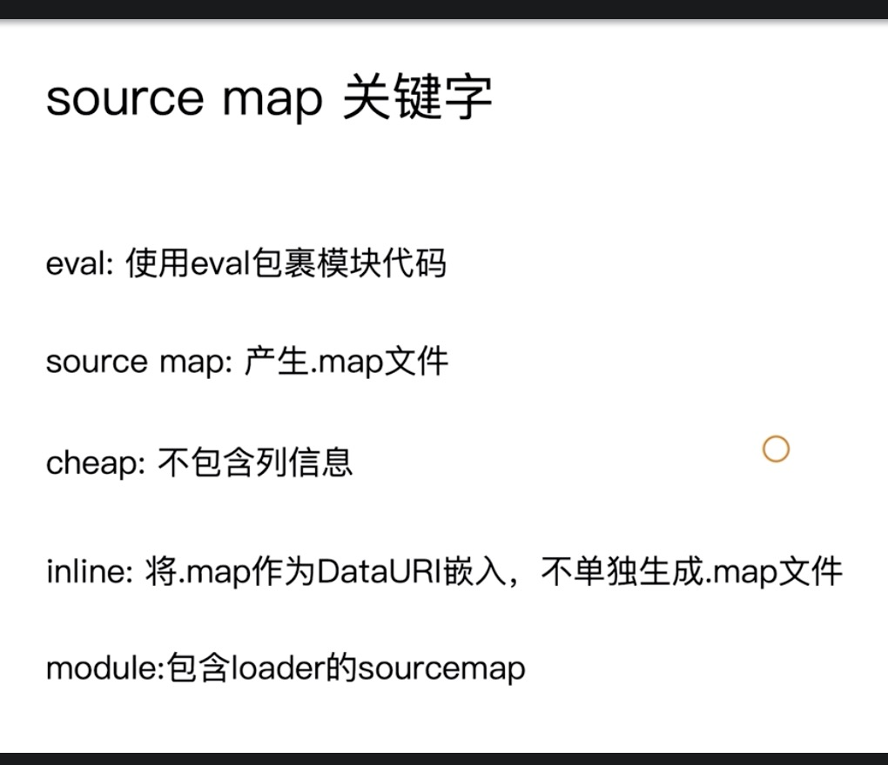
    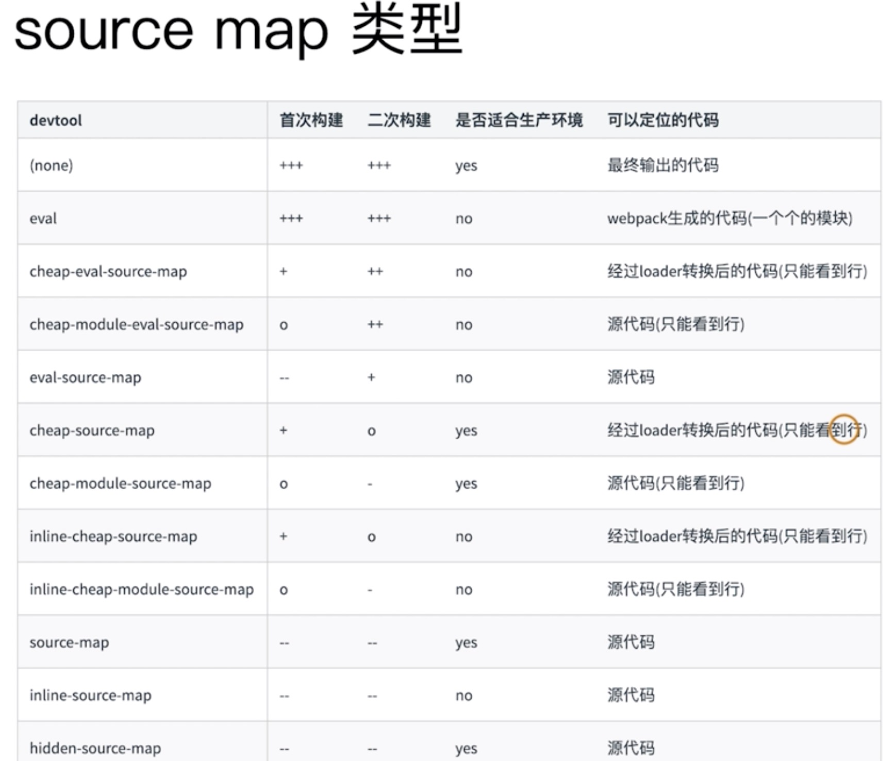

    ```javascript
    // webpack.config.js里面
    devtool: "source-map";
    ```

-   基础库分离

    -   思路：将 react、react-dom 基础包通过 cdn 引入，不打入 bundle 中
    -   方法：使用 html-webpack-externals-plugin
        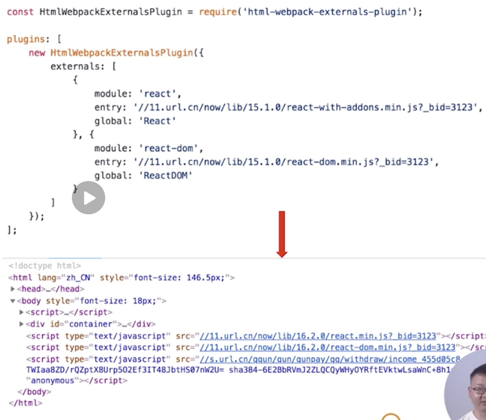

    ##分离基础包方法一

        `bash npm i html-webpack-externals-plugin -D`

            ```javascript
            //webpack.config.js文件里加一下代码：
            const HtmlWebpackExternalsPlugin = require("html-webpack-externals-plugin");
            new HtmlWebpackExternalsPlugin({
                externals: [
                    {
                        module: "react",
                        entry:
                            "https://unpkg.com/react@16.9.0/umd/react.production.min.js",
                        global: "React"
                    },
                    {
                        module: "react-dom",
                        entry:
                            "https://unpkg.com/react-dom@16.9.0/umd/react-dom.production.min.js",
                        global: "ReactDOM"
                    }
                ]
            });

            //对应的页面加上
            <script
                crossorigin
                src="https://unpkg.com/react@16.9.0/umd/react.production.min.js"
            ></script>
            <script
                crossorigin
                src="https://unpkg.com/react-dom@16.9.0/umd/react-dom.production.min.js"
            ></script>
            ```

    -   方法：
        -   分离基础包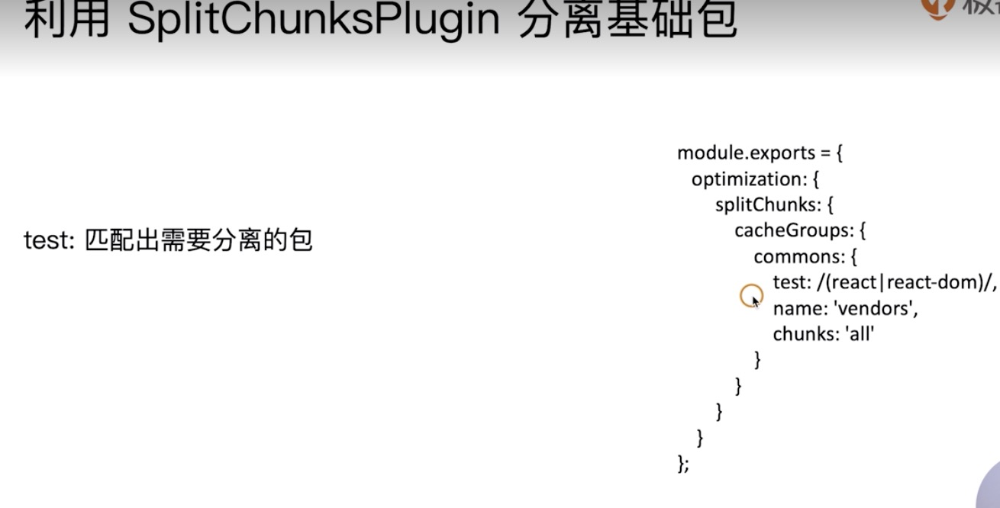
        -   分离页面公共文件 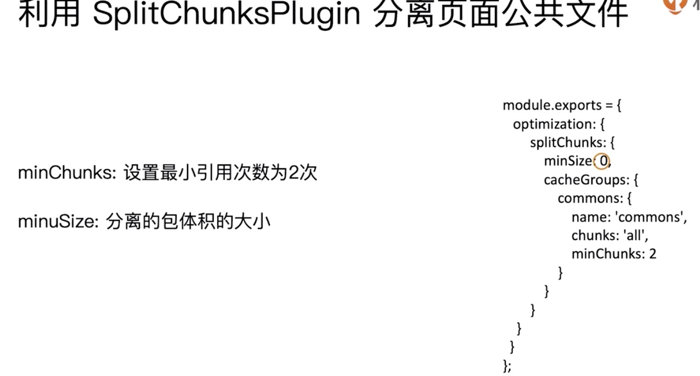
        -   进行公共脚本分离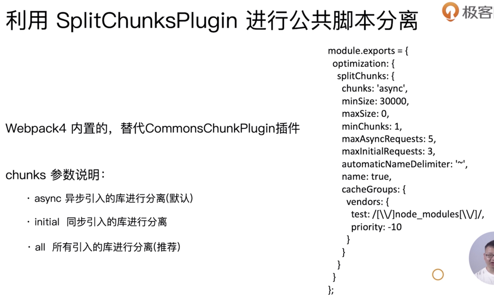

    ##分离基础包方法二

    ```javascript
    /**
     * 动态的获取entry
     */
    const setMPA = () => {
        const entry = {};
        const htmlWebpackPlugins = [];

        const entryFiles = glob.sync(path.join(__dirname, "./src/*/index.js"));
        Object.keys(entryFiles).map(index => {
            const entryFile = entryFiles[index];
            //'/Users/fangcao/Documents/study/study_webpack/src/index/index.js'
            const match = entryFile.match(/src\/(.*)\/index\.js/);

            const pageName = match && match[1];
            entry[pageName] = entryFile;

            htmlWebpackPlugins.push(
                new HtmlWebpackPlugin({
                    template: path.join(
                        __dirname,
                        `src/${pageName}/index.html`
                    ),
                    filename: `${pageName}.html`,
                    chunks: ["vendors", pageName],
                    inject: true,
                    minify: {
                        html5: true,
                        collapseWhitespace: true,
                        preserveLineBreaks: false,
                        minifyCSS: true,
                        minifyJS: true,
                        removeComments: false
                    }
                })
            );
            // console.log("pageName", match, match[1], pageName, entry);
        });

        // console.log("entryFiles", entryFiles);

        return {
            entry,
            htmlWebpackPlugins
        };
    };

    optimization: {
        splitChunks: {
            cacheGroups: {
                commons: {
                    test: /(react|react-dom)/,
                    name: "vendors",
                    chunks: "all"
                }
            }
        }
    }
    ```

    ##分离页面公共文件

    ```javascript
    /**
     * 动态的获取entry
     */
    const setMPA = () => {
        const entry = {};
        const htmlWebpackPlugins = [];

        const entryFiles = glob.sync(path.join(__dirname, "./src/*/index.js"));
        Object.keys(entryFiles).map(index => {
            const entryFile = entryFiles[index];
            //'/Users/fangcao/Documents/study/study_webpack/src/index/index.js'
            const match = entryFile.match(/src\/(.*)\/index\.js/);

            const pageName = match && match[1];
            entry[pageName] = entryFile;

            htmlWebpackPlugins.push(
                new HtmlWebpackPlugin({
                    template: path.join(
                        __dirname,
                        `src/${pageName}/index.html`
                    ),
                    filename: `${pageName}.html`,
                    chunks: ["commons", pageName],
                    inject: true,
                    minify: {
                        html5: true,
                        collapseWhitespace: true,
                        preserveLineBreaks: false,
                        minifyCSS: true,
                        minifyJS: true,
                        removeComments: false
                    }
                })
            );
            // console.log("pageName", match, match[1], pageName, entry);
        });
    optimization: {
        splitChunks: {
            minSize: 0,
            // minSize: 1000, //当有公共的文件小于1000时，就不打包，还是嵌入在文件里
            cacheGroups: {
                commons: {
                    name: "commons",
                    chunks: "all",
                    minChunks: 2 //commons要引入2次以上就打出包来，小于2次不打
                }
            }
        }
    }
    ```

-   摇树优化 必须是`ES6`语法,`CJS`方式不支持

    -   tree shaking

        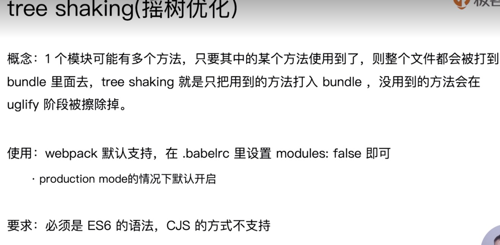

    -   DCE（Elimination）

        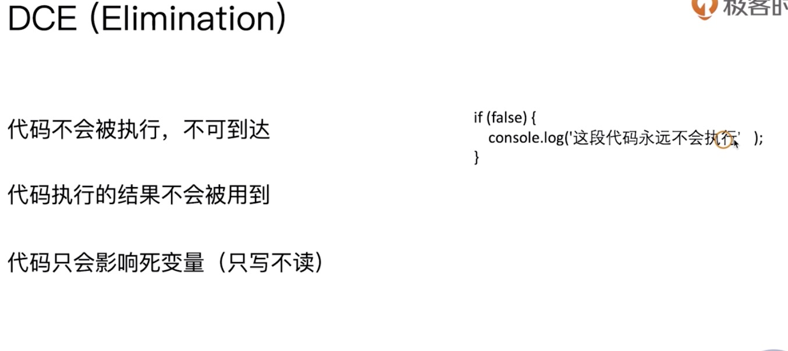

    -   tree shaking 原理：没有用到的代码，增加注释做标记，打包的时候擦除

        利用 `ES6` 模块的特点：

        -   只能作为模块顶层的语句出现
        -   import 的模块名只能是字符串常量
        -   import bingding 是 immutable 的

        代码擦除：uglify 阶段删除无用代码

    ```javascript
    // tree-shaking.js
    export function a() {
        return "This is func a";
    }
    export function b() {
        return "This is func b";
    }
    ```

-   构建后的代码存在大量闭包代码

    -   进一步分析 webpack 的模块机制

        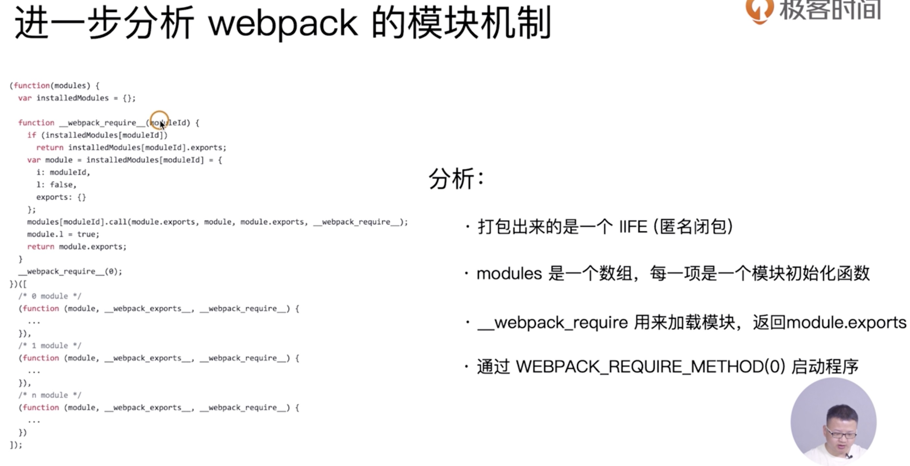

    -   scope hoisting 原理
        原理：将所有模块的代码按照引用顺序放在一个函数作用域里，然后适当的重命名一些变量以防止变量名冲突

        对比：通过 scope hoisting 可以减少函数声明代码和内存开销

        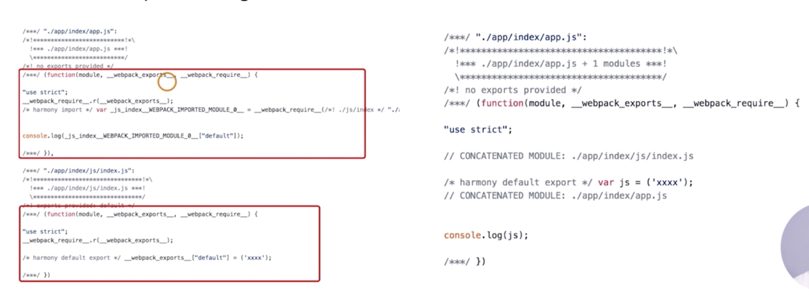

        webpack mode 为 production 默认开启，必须是 ES6 语法，CJS 不支持。

        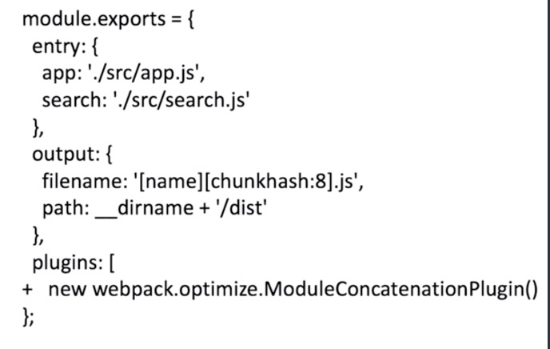

        ```javascript
        const webpack = require("webpack");
        plugins: [
            new webpack.optimize.ModuleConcatenationPlugin()
        }
        ```

-   代码分割和动态 import

    -   懒加载 JS 脚本的方式
        -   CommonJS:require.ensure
        -   ES6:动态 import（目前还没有原生支持，需要 babel 转换）
    -   如何使用动态 import?
        ```bash
            npm i install @babel/plugin-syntax-dynamic-import -D
        ```
        ```javascript
        import("./text.js").then(Text => {
            console.log(Text);
            this.setState({
                Text: Text.default
            });
        });
        //babelrc
        {
            "presets": ["@babel/preset-env", "@babel/preset-react"],
            "plugins": ["@babel/plugin-syntax-dynamic-import"]
        }
        ```

-   webpack 和 ESLint 结合

    -   alloyteam 团队 eslint-config-alloy(https://github.com/AlloyTeam/eslint-config-alloy)
    -   ivweb 团队：eslint-config-ivweb(https://github.com/feflow/eslint-config-ivweb)
        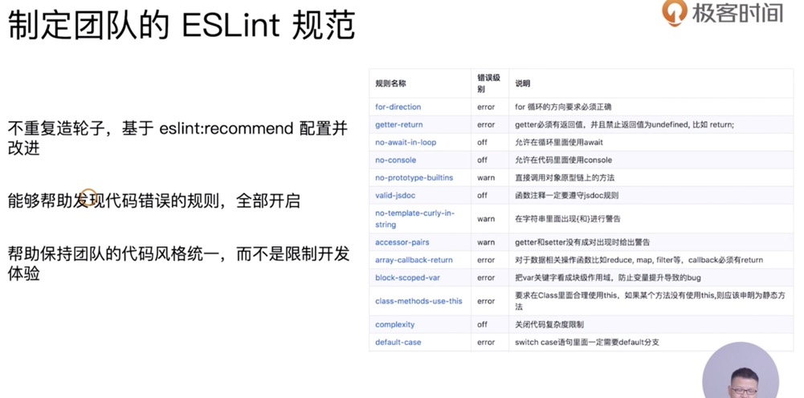
    -   ESlint 如何执行落地？

        -   和 CI/CD 系统集成

            ## 方案一 webpack 与 CI/CD 集成

            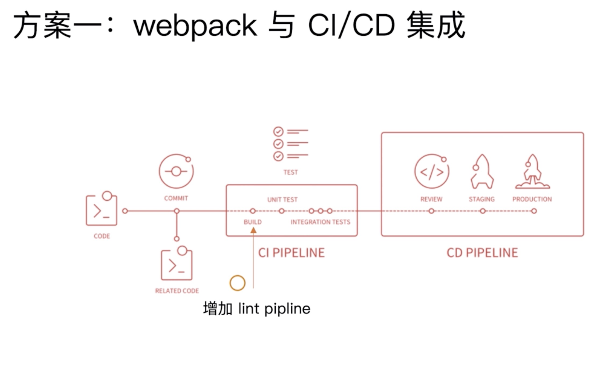

            ## 本地开发阶段增加 precommit 钩子

            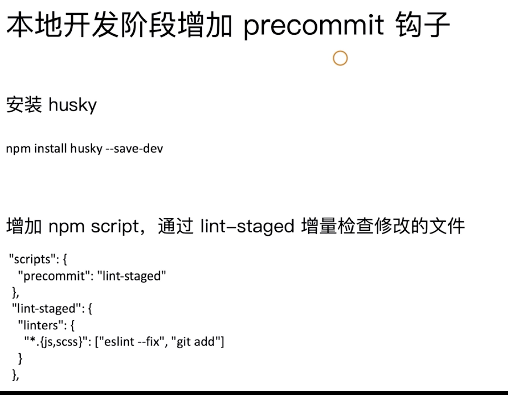

        -   和 webpack 集成

            ## 方案二 webpack 与 ESLint 集成（适合新项目，一开始重新做的项目）

            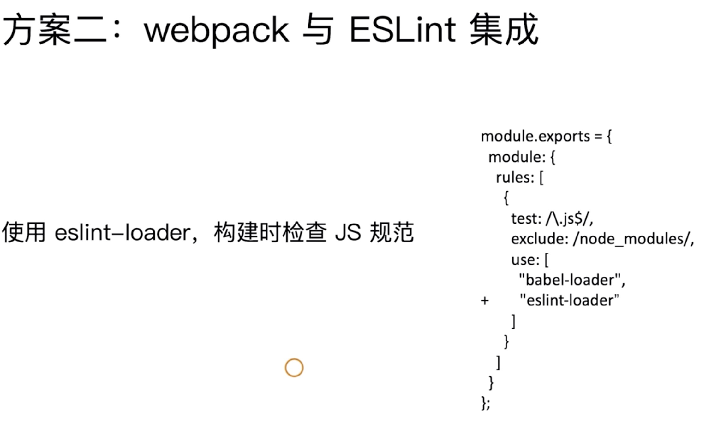

        ```bash
        npm i eslint eslint-plugin-import eslint-plugin-react eslint-plugin-jsx-a11y -D

        npm i eslint-loader -D

        npm i babel-eslint -D

        npm i eslint-config-airbnb -D
        ```

        [ESLint](http://eslint.cn/) 官网文档 [ESLint rules](http://eslint.cn/docs/rules/)

        ```javascript
        //.eslintrc.js
        module.exports = {
            parser: "babel-eslint",
            extends: "airbnb",
            // extends: "eslint:recommended",
            env: {
                browser: true,
                node: true,
                commonjs: true,
                es6: true
            },
            rules: {
                indent: ["error", 4],
                quotes: [2, "double"],
                semi: ["error", "always"],
                "comma-dangle": [
                    "error",
                    {
                        arrays: "never",
                        objects: "never",
                        imports: "never",
                        exports: "never",
                        functions: "never"
                    }
                ],
                "no-console": 0,
                "no-unused-vars": "off",
                "react/jsx-indent": "off",
                "react/jsx-filename-extension": "off",
                "react/jsx-indent-props": "off",
                "react/react-in-jsx-scope": "off",
                "react/self-closing-comp": "off",
                "react/jsx-closing-tag-location": "off",
                "jsx-a11y/no-noninteractive-element-interactions": "off",
                "jsx-a11y/click-events-have-key-events": "off",
                "react/jsx-one-expression-per-line": "off",
                "react/jsx-one-expression-per-line": "off",
                "react/jsx-fragments": "off",
                "lines-between-class-members": "off",
                "arrow-parens": "off",
                "import/no-extraneous-dependencies": "off",
                "prefer-rest-params": "off",
                strict: "off",
                "import/newline-after-import": "off",
                "import/prefer-default-export": "off"
            }
        };

        //webpack
        module: {
            rules: [
                {
                    test: /.js$/,
                    use: ["babel-loader", "eslint-loader"]
                }
            ];
        }
        ```

-   webpack 打包库和组件
    引用我们写好的组件库 源码分支在 large-number 上
    ```bash
    sudo npm i large-number-wfc@1.0.4 -D
    ```
-   SSR 代码实现思路

    -   服务端

        -   使用 `react-dom/server` 的 `renderToString` 方法将 React 组件渲染成字符串
        -   服务端路由返回对应的模版

    -   客户端

        打包出针对服务端的组件

    过程：

    1.建立`webpack.ssr.js`

    2.在`package.json`加一个`build:ssr`

    ```json
    "scripts": {
        "test": "echo \"Error: no test specified\" && exit 1",
        "build": "webpack",
        "probuild": "webpack --config webpack.prod.js",
        "watch": "webpack --watch",
        "dev": "webpack-dev-server --config webpack.dev.js --open",
        "build:ssr": "webpack --config webpack.ssr.js"
    },
    ```

    3.建立`server/index.js`

    4.安装

    ```bash
    npm i express -D
    ```

    5.建立 `src/search/index-server.js`

    6.开启服务器前，先打包`yarn build:ssr`,后开启`node server/index.js`，运行看到了 ssr 后的效果

    webpack ssr 打包村子的问题

    -   浏览器的全局变量(Node.js 中没有 `document`,`window`)

        -   组件适配：将不兼容的组件根据打包环境进行适配
        -   请求适配：将 fetch 或者 ajax 发送请求的写法改成 `isomorphic-fetch` 或者 `axios`

    -   样式问题（Node.js 无法解析 css）

        -   方案一：服务端打包通过 `ignore-loader` 忽略掉 css 的解析
        -   方案二：将 `style-loader` 替换成 `isomorphic-style-loader`

-   如何解决样式不显示的问题？

    -   使用打包出来的浏览器端 html 为模块

    -   设置占位符，动态插入组件

    ```javascript
    // src/search/index.html
    <!--HTML_PLACEHOLDER-->
    ```

    ```javascript
    // server/index.js
    return template.replace("<!--HTML_PLACEHOLDER-->", str);
    ```

-   首屏数据如何处理？

    -   服务端获取数据
    -   替换占位符

    ```javascript
    const renderMarkup = str => {
        const dataStr = JSON.stringify(data);
        return template
            .replace("<!--HTML_PLACEHOLDER-->", str)
            .replace(
                "<!--INITIAL_DATA_PLACEHOLDER-->",
                `<script>window.__initial_data=${dataStr}</script>`
            );
    };
    server(process.env.PORT || 3000);
    ```

    ```html
    <!DOCTYPE html>
    <html lang="en">
        <head>
            ${require('raw-loader!./meta.html')}
            <title>Document</title>
            <script type="text/javascript">
                ${require('raw-loader!babel-loader!../../node_modules/lib-flexible/flexible.js')}
            </script>
        </head>
        <body>
            <div id="root"><!--HTML_PLACEHOLDER--></div>

            <script
                crossorigin
                src="https://unpkg.com/react@16.9.0/umd/react.production.min.js"
            ></script>
            <script
                crossorigin
                src="https://unpkg.com/react-dom@16.9.0/umd/react-dom.production.min.js"
            ></script>
            <!--INITIAL_DATA_PLACEHOLDER-->
        </body>
    </html>
    ```

-   统计信息 status

    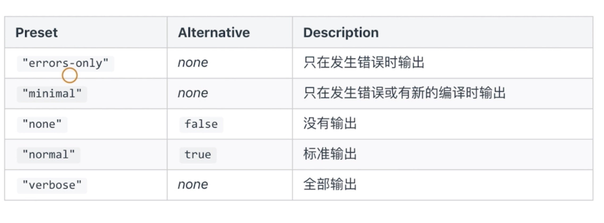

-   如何优化命令行的构建日志

    -   使用`friendly-errors-webpack-plugin`

        -   success:构建成功的日志提示
        -   warning:构建警告的日志提示
        -   error:构建报错的日志提示

    -   stats 设置成 errors-only

    ```bash
    sudo npm i -D friendly-errors-webpack-plugin
    ```

    ```javascript
    // webpack.pro.js  webpack.dev.js
    const FriendlyErrorsWebpackPlugin = require("friendly-errors-webpack-plugin");
    plugins: [
        ...
        // new webpack.optimize.ModuleConcatenationPlugin(), //当mode为production时，这个去掉
        new FriendlyErrorsWebpackPlugin()
    ].concat(htmlWebpackPlugins),
    ```

-   构建异常和中断处理

    -   在 CI/CD 的 pipline 或者发布系统需要知道当前构建状态
    -   每次构建完成后输入 echo \$? 获取错误码

    webpack4 之前的版本构建失败不会抛出错误码(error code)

    Node.js 中的 process.exit 规范

    -   0 表示成功完成，回调函数中，err 为 null
    -   非 0 表示执行失败，回调函数中，err 不为 null,err.code 就是传给 exit 的数字

    ```bash
    // 构建后，可以输入这个
    echo $?
    ```
