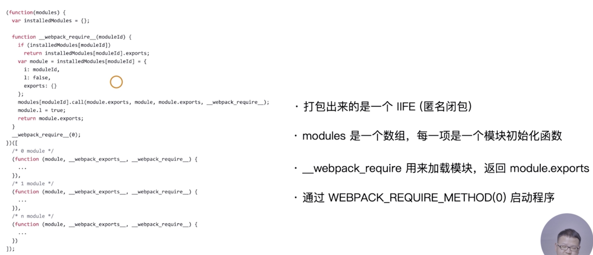

[AST](https://esprima.org/demo/parse.html)(abstract syntax tree)

# webpack 的模块机制

动手实现一个简易的 webpack

-   可以将 ES6 语法转换成 ES5 的语法

    -   通过 babylon 生成 AST
    -   通过 babel-core 将 AST 重新生成源码

-   可以分析模块之间的依赖关系

    -   通过 babel-traverse 的 ImportDeclaration 方法获取依赖属性

-   生成的 JS 文件可以在浏览器中运行

运行`node ./lib/index.js`,然后运行`./dist/index.html`
